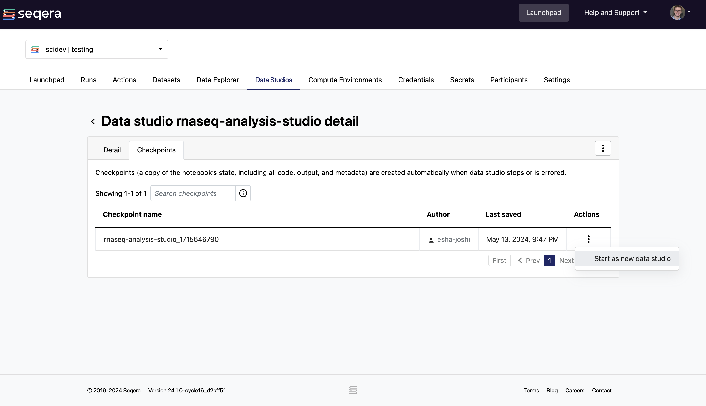

## Analyse RNAseq data using Jupyter Notebooks in Data Studios

Data Studio can be used to perform tertiary analysis of data generated by Nextflow pipeline executions on Seqera Platform. For example, we can take a look at our nf-core/rnaseq pipeline results in a Jupyter notebook to perform additional interactive analyses.

### 1. Create a Data Link {#hidden-heading}
To enable access to our RNAseq analysis data in a Studio, we can create a custom data link pointing to the directory in our AWS S3 bucket where the results are saved. 

This can be achieved by using the 'Add cloud bucket' button in Data Explorer and specifying the path to our output directory:

{ .center }


### 2. Create a Jupyter notebook session {#hidden-heading}
When creating our Data Studio, we can mount our newly created Data Link to isolate read/write access to this directory within the studio session.


### 3. Data exploration in Jupyter {#hidden-heading}
Once created, we can Connect to our Data Studio to open a Jupyter notebook session where we can take a look at the results of our RNAseq analysis. 

For example, in the notebook, you may first want to import Python libraries:

```python
import pandas as pd
```

We can load in our data from the analyses. For example, as a start, lets take a look at our transcript counts across the samples when loaded into a Pandas dataframe:

```python
data = pd.read_csv('data/seqeralabs-showcase-rnaseq-results/star_salmon/salmon.merged.gene_counts.tsv', sep='\t', index_col=0)
print(data.head())
```


Through Data Studios, you are now able to continue into the next step of your tertiary analyses, using data generated from pipelines executed on Seqera Platform but stored in the Cloud - without having to ever leave the Platform.

## Checkpoints in Data studios

When starting a data studio, a checkpoint gets created. This checkpoint allows you to restart a data studio with previously installed software and changes made to the root filesystem of the container. Please note, that if you stop a data studio and restart it, this will restart it from the latest checkpoint. To go back to a specific previous configuration of data studio session, please restart it from a checkpoint as highlighted in the screenshot below:




## More information

If you want more detailed explanation about specific concepts of Data Studios or find out which tools are preinstalled in Data Studio images, please visit [Seqera Platform Docs](https://docs.seqera.io/platform/23.4.0/data/data-studios)